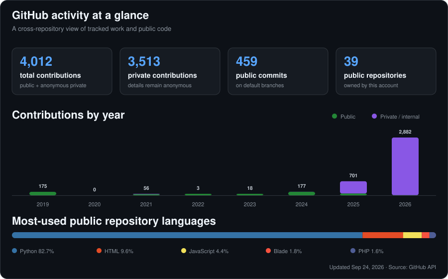

# Hi, I'm Antoon 👋

### I turn real operational problems into practical software.

Web applications · Mobile products · Automation · Data & AI

## What I build

I enjoy taking an idea from an operational need to a working product—shaping the experience, building the software, connecting the data, and improving it from real feedback. My public work includes analytics dashboards, business tools, responsive web experiences, mobile applications, and automation.

## GitHub activity

This snapshot is generated from GitHub's API and refreshes automatically every week. GitHub counts commits on a repository's default or `gh-pages` branch; private work is included only when GitHub's private-contribution visibility setting allows it.

## Selected work

| Project | What it demonstrates |
| --- | --- |
| [**Scout Custody System**](https://github.com/Eng-antoon/Scout-Custody-System) | An Arabic, role-based inventory and custody management experience using JavaScript and Firebase. |
| [**NavonaAI Wireframes & Flows**](https://github.com/Eng-antoon/navonaAI) | Responsive product flows, merchant tooling, analytics views, and technical architecture documentation. |
| [**Trips Analysis**](https://github.com/Eng-antoon/TripsAnalysis) | A Python data workflow and dashboard for consolidating, storing, and exploring trip data. |
| [**Ciphers App**](https://github.com/Eng-antoon/Ciphers-app) | A focused browser-based JavaScript application for learning and working with ciphers. |

## Tools I work with

  
  
  
  
  
  

---

  <a href="https://github.com/Eng-antoon?tab=repositories"><strong>Explore all public repositories →</strong></a>

